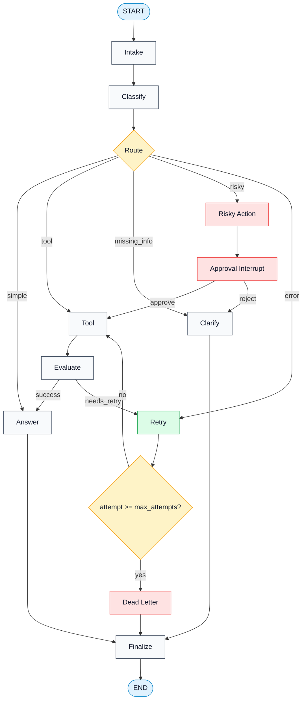
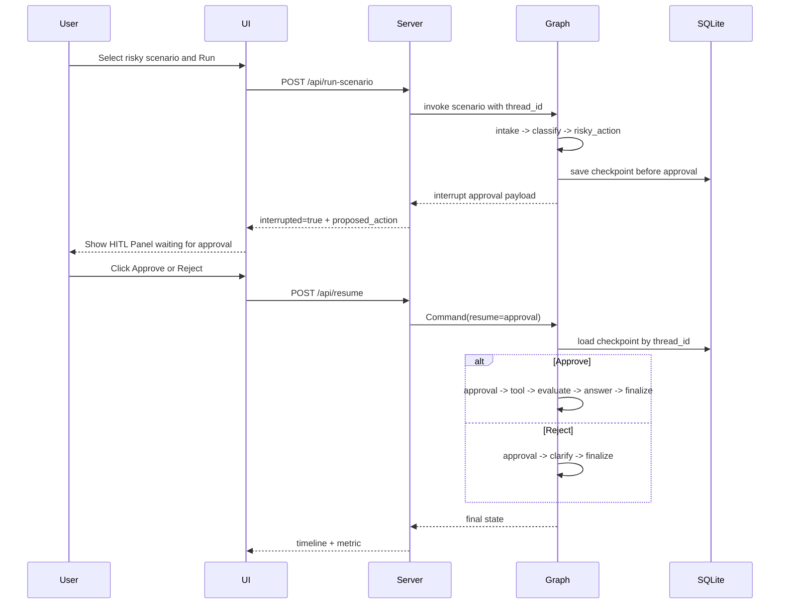

# Presentation Guide — LangGraph Scenario-Driven Fault-Tolerance Lab

## 1. Mục tiêu bài lab

Bài lab này không chỉ xây một support-ticket agent đơn giản. Mục tiêu chính là xây một **scenario runner + resilience test harness** để kiểm tra khả năng chịu lỗi của workflow LangGraph trong các tình huống gần với thực tế.

Hệ thống hiện tại có thể:

- Load nhiều scenario từ `data/sample/scenarios.jsonl`.
- Route request vào các nhóm: `simple`, `tool`, `missing_info`, `risky`, `error`.
- So sánh route thực tế với route kỳ vọng.
- Test retry loop có giới hạn bằng `max_attempts`.
- Đưa lỗi không recover được vào dead-letter path.
- Dừng workflow thật ở bước human approval với HITL interrupt.
- Resume workflow sau khi người dùng approve/reject trên UI.
- Lưu checkpoint bằng SQLite để chứng minh state có thể được giữ lại giữa các bước.
- Hiển thị timeline, metrics, expected/actual route trên UI HTML/CSS/JS thuần.

## 2. Ý tưởng chính

Thay vì chỉ hỏi agent một câu rồi xem câu trả lời, lab này tập trung vào câu hỏi:

> Nếu workflow gặp input thiếu thông tin, action rủi ro, tool lỗi tạm thời, hoặc lỗi không thể recover, hệ thống xử lý có kiểm soát không?

Vì vậy, trọng tâm không nằm ở chatbot UI, mà nằm ở **test harness**:

1. Mỗi scenario mô tả input, expected route và metadata fault-tolerance.
2. Runner chạy scenario qua LangGraph.
3. Graph ghi lại từng node đã đi qua.
4. Metrics đánh giá route đúng/sai, retry count, dead-letter, approval, checkpoint.
5. UI giúp demo trực quan từng luồng.

## 3. Kiến trúc hiện tại

```mermaid
flowchart LR
  UI[HTML/CSS/JS UI] -->|HTTP| S[Stdlib Python HTTP Server]
  S --> R[Scenario Runner]
  R --> J[scenarios.jsonl]
  R --> G[LangGraph Runtime]
  G --> C[SQLite Checkpointer]
  G --> N[Workflow Nodes]
  N --> M[Metrics / Report]

  classDef ui fill:#dbeafe,stroke:#2563eb,color:#0f172a;
  classDef backend fill:#dcfce7,stroke:#16a34a,color:#0f172a;
  classDef graph fill:#f3e8ff,stroke:#7c3aed,color:#0f172a;
  classDef storage fill:#fff7ed,stroke:#f97316,color:#0f172a;

  class UI ui
  class S,R backend
  class G,N graph
  class J,C,M storage
```

### Thành phần chính

| Thành phần | Vai trò |
|---|---|
| `data/sample/scenarios.jsonl` | Bộ scenario thực tế và edge cases để test workflow. |
| `src/langgraph_agent_lab/scenarios.py` | Load và validate scenario, kiểm tra duplicate ID. |
| `src/langgraph_agent_lab/state.py` | Định nghĩa state, route, event, approval decision. |
| `src/langgraph_agent_lab/nodes.py` | Các node xử lý workflow: intake, classify, tool, approval, retry, dead-letter, finalize. |
| `src/langgraph_agent_lab/routing.py` | Conditional routing giữa các node. |
| `src/langgraph_agent_lab/faults.py` | Controlled fault injection dựa trên metadata scenario. |
| `src/langgraph_agent_lab/tools.py` | Local lab tools thật trong phạm vi demo. |
| `src/langgraph_agent_lab/persistence.py` | SQLite checkpointer cho checkpoint/resume. |
| `src/langgraph_agent_lab/runner.py` | API nội bộ để chạy 1 scenario hoặc batch scenario. |
| `src/langgraph_agent_lab/web_server.py` | HTTP server bằng Python standard library, không dùng FastAPI. |
| `src/langgraph_agent_lab/static/app.js` | Frontend logic để run scenario, approve/reject, render timeline. |
| `outputs/metrics.json` | Output metrics sau khi chạy batch scenario. |

## 4. Luồng xử lý ngắn gọn

Luồng xử lý hiện tại có thể tóm tắt như sau:

1. **User chọn scenario trên UI** và bấm Run.
2. **Frontend gọi HTTP server** qua endpoint `/api/run-scenario`.
3. **Server gọi Scenario Runner** để load scenario, tạo initial state và build LangGraph.
4. **LangGraph chạy node `intake`** để normalize query và ghi event đầu tiên.
5. **Node `classify` chọn route** dựa trên nội dung query và metadata scenario.
6. Tùy route, workflow đi theo một trong các nhánh:
   - `simple` → tạo answer → finalize.
   - `tool` → gọi local tool → evaluate → answer/finalize.
   - `missing_info` → hỏi thêm thông tin → finalize.
   - `risky` → chuẩn bị action rủi ro → dừng ở HITL approval.
   - `error` → chạy retry loop → recover hoặc dead-letter.
7. **Mỗi node ghi event vào state**, nên UI có thể render Flow Timeline.
8. **SQLite checkpointer lưu state theo `thread_id`**, đặc biệt quan trọng cho HITL resume.
9. Nếu workflow bị interrupt ở HITL, **user bấm Approve/Reject** trên UI.
10. Server gửi `Command(resume=...)` vào LangGraph để workflow chạy tiếp từ checkpoint.
11. Khi kết thúc, runner tạo **metric** gồm expected route, actual route, retry count, dead-letter, approval và success.

Nói cực ngắn khi thuyết trình:

> UI gửi scenario vào server, server chạy scenario runner, runner đưa state vào LangGraph. Graph classify request rồi route sang answer/tool/clarify/retry/HITL. Mỗi bước ghi event, SQLite giữ checkpoint, cuối cùng UI hiển thị timeline và metrics.

## 5. Luồng xử lý graph



## 5. Route priority

Route priority hiện tại theo tinh thần plan:

```text
risky > error/retry metadata > missing_info > tool > simple
```

Ví dụ:

- `Refund order 12345 and then check delivery status` route về `risky`, không phải `tool`, vì refund là hành động rủi ro.
- `Please check my order` route về `missing_info`, vì thiếu order ID cụ thể.
- Scenario có `should_retry=true` route về `error` để kích hoạt retry/fault tolerance path.
- `I do not want to delete anything, just explain the retention policy` route về `simple`, vì có negation tránh false positive risky.

## 6. Controlled fault injection

Một điểm quan trọng của lab là lỗi phải reproducible.

Nếu chỉ chờ OpenAI hoặc service bên ngoài lỗi ngẫu nhiên thì test sẽ flaky. Vì vậy hệ thống dùng **controlled fault injection** dựa trên scenario metadata:

```json
{
  "should_retry": true,
  "max_attempts": 3,
  "tags": ["error", "retry", "timeout"]
}
```

Cách hiểu:

- Đây không phải mock kết quả thành công.
- Đây là cách chủ động tạo failure để kiểm tra retry/dead-letter.
- Tool vẫn trả lỗi thật theo rule của harness.
- Graph phải xử lý lỗi bằng retry loop hoặc dead-letter.

Luồng retry:

1. Scenario có `should_retry=true`.
2. Tool trả `ERROR: controlled fault ...`.
3. Evaluate node đánh dấu `needs_retry`.
4. Retry node tăng `attempt`.
5. Nếu chưa vượt `max_attempts`, quay lại tool.
6. Nếu vượt giới hạn, đi dead-letter.

## 7. HITL Panel là gì

HITL là **Human-In-The-Loop**.

Trong UI, HITL Panel dùng cho các scenario `risky`, ví dụ:

- refund tiền
- delete account
- cancel subscription
- revoke access
- send email

Những action này không được auto-execute. Workflow phải dừng lại để người thật approve/reject.



### Demo HITL hiện tại

1. Mở UI: `http://127.0.0.1:8765`
2. Chọn scenario risky, ví dụ `S24_risky_send_email`.
3. Để trống Thread ID để UI tự sinh thread mới.
4. Bấm **Run selected**.
5. HITL Panel sẽ hiện:

```text
Waiting for human approval on thread ...
```

6. Timeline lúc này chỉ dừng ở:

```text
intake -> classify -> risky_action
```

7. Nhập comment và bấm **Approve**.
8. Workflow resume và timeline sẽ tiếp tục:

```text
approval -> tool -> evaluate -> answer -> finalize
```

Nếu bấm **Reject**, workflow đi sang `clarify -> finalize`.

## 8. UI hiện tại

UI là HTML/CSS/JS thuần, không dùng React/Vue/FastAPI.

Các vùng chính:

| UI section | Chức năng |
|---|---|
| Scenario Catalog | Hiển thị toàn bộ scenario, route badge. |
| Runner | Chạy scenario được chọn hoặc batch non-HITL. |
| Expected vs Actual | Hiển thị metric JSON: expected route, actual route, success, retry count. |
| Flow Timeline | Hiển thị node timeline từ event log. |
| HITL Panel | Hiển thị approval payload và nút Approve/Reject. |

Backend endpoints hiện có:

```text
GET  /api/scenarios
POST /api/run-scenario
POST /api/run-all
POST /api/resume
GET  /api/metrics
GET  /api/state?thread_id=...
```

## 9. Metrics dùng để đánh giá

Mỗi scenario tạo một metric gồm các field chính:

| Field | Ý nghĩa |
|---|---|
| `scenario_id` | Scenario đang chạy. |
| `expected_route` | Route kỳ vọng từ file JSONL. |
| `actual_route` | Route graph thực tế chọn. |
| `success` | Expected route khớp actual route và có terminal output. |
| `nodes_visited` | Số event/node đã đi qua. |
| `retry_count` | Số lần retry. |
| `max_attempts` | Retry limit của scenario. |
| `approval_required` | Scenario có cần HITL không. |
| `approval_observed` | Graph đã nhận approval chưa. |
| `dead_letter_observed` | Có đi dead-letter không. |
| `checkpoint_thread_id` | Thread ID dùng cho checkpoint/resume. |
| `errors` | Error events được ghi nhận. |

Sau khi chạy batch:

```bash
.venv/Scripts/python -m langgraph_agent_lab.cli run-scenarios --config configs/lab.yaml --output outputs/metrics.json
.venv/Scripts/python -m langgraph_agent_lab.cli validate-metrics --metrics outputs/metrics.json
```

## 10. Các lệnh demo

### Chạy test

```bash
.venv/Scripts/python -m pytest
```

### Chạy coverage

```bash
.venv/Scripts/python -m pytest --cov=src --cov-report=term-missing
```

### Lint và typecheck

```bash
.venv/Scripts/python -m ruff check src tests
.venv/Scripts/python -m mypy src
```

### Chạy batch scenario

```bash
.venv/Scripts/python -m langgraph_agent_lab.cli run-scenarios --config configs/lab.yaml --output outputs/metrics.json
```

### Validate metrics

```bash
.venv/Scripts/python -m langgraph_agent_lab.cli validate-metrics --metrics outputs/metrics.json
```

### Chạy UI

```bash
.venv/Scripts/python -m langgraph_agent_lab.cli serve-ui --config configs/lab.yaml
```

Sau đó mở:

```text
http://127.0.0.1:8765
```

## 11. Demo script gợi ý khi thuyết trình

### Phần 1 — Giới thiệu vấn đề

Nói:

> Một agent production không chỉ cần trả lời đúng happy path. Nó phải biết xử lý input thiếu thông tin, tool lỗi, retry có giới hạn, dead-letter, và những action cần người duyệt.

### Phần 2 — Giới thiệu scenario suite

Mở `data/sample/scenarios.jsonl` và chỉ ra các nhóm:

- simple
- tool
- missing_info
- risky
- error
- dead_letter
- checkpoint/resume
- priority conflict

Nói:

> Mỗi scenario là một test case thực tế. Chúng tôi không hard-code theo ID mà dùng metadata và routing policy để kiểm tra workflow.

### Phần 3 — Demo simple/tool/missing_info

Trên UI:

1. Chọn `S01_simple`.
2. Bấm Run selected.
3. Chỉ timeline `intake -> classify -> answer -> finalize`.

Sau đó chọn tool scenario như `S37_tool_case_punctuation`:

```text
intake -> classify -> tool -> evaluate -> answer -> finalize
```

### Phần 4 — Demo retry/dead-letter

Chọn scenario retry như `S05_error` hoặc `S26_error_timeout_tool`.

Nói:

> Scenario này cố ý inject controlled fault. Graph không crash mà đi qua evaluate, retry, rồi recover hoặc dead-letter tùy max_attempts.

Chọn dead-letter scenario như `S30_dead_letter_permanent`.

Chỉ field:

```json
"dead_letter_observed": true
```

### Phần 5 — Demo HITL

Chọn `S24_risky_send_email`.

1. Run selected.
2. Chỉ HITL Panel đang `Waiting for human approval`.
3. Chỉ timeline dừng ở `risky_action`.
4. Bấm Approve.
5. Chỉ timeline tiếp tục đến `finalize`.

Nói:

> Điểm quan trọng là action rủi ro không tự chạy. Graph interrupt thật và resume bằng approval payload.

### Phần 6 — Kết luận

Nói:

> Kết quả cuối cùng là một harness có thể mở rộng: chỉ cần thêm scenario mới vào JSONL để kiểm tra thêm edge case. Metrics giúp đánh giá workflow theo route accuracy, retry behavior, dead-letter, HITL và checkpoint evidence.

## 12. Những điểm nên nhấn mạnh

- Không dùng mock approval trong UI demo; risky action dừng thật bằng interrupt.
- Không dùng FastAPI, backend là Python standard library HTTP server.
- SQLite checkpoint lưu state theo `thread_id`.
- Controlled fault injection giúp test lỗi reproducible, không phụ thuộc lỗi ngẫu nhiên.
- Unit tests không gọi OpenAI thật để tránh flaky/cost.
- Runtime vẫn có OpenAI adapter và `.env` loading cho integration thật.
- Batch runner bỏ qua HITL scenario mặc định để không block automation.

## 13. Giới hạn hiện tại

Các điểm có thể nói là future work:

- UI còn đơn giản, chưa có filter nâng cao theo tag/route.
- Endpoint `/api/history` mới được mô tả trong plan, chưa tách riêng thành history view đầy đủ.
- OpenAI integration hiện mới có adapter/config, chưa bắt buộc mọi node gọi LLM trong test suite.
- Report hiện là bản summary cơ bản, có thể mở rộng thêm confusion matrix và coverage table.
- Không execute destructive action thật; risky action chỉ ghi evidence trong lab để đảm bảo an toàn.
