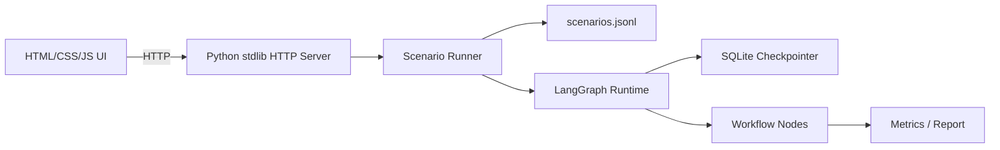
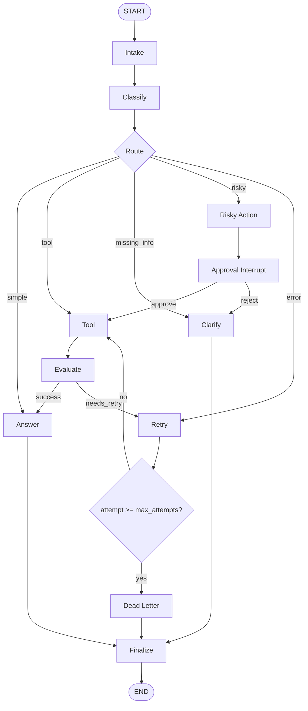
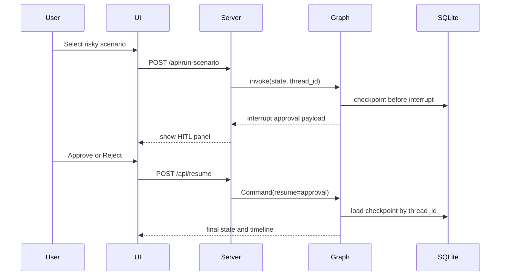

# Day 08 Lab Report

## 1. Team / student

- **Name:** Nguyễn Huy Tú
- **MSV:** 2A202600170
- **Repo/commit:** `a1996ba`
- **Date:** 2026-05-11
- **Project:** `phase2-track3-day8-langgraph-agent`

## 2. Architecture

Bài lab được triển khai như một **scenario runner + resilience test harness** cho LangGraph workflow. Mục tiêu không chỉ là trả lời câu hỏi, mà là kiểm tra workflow có xử lý đúng các tình huống thực tế như thiếu thông tin, tool failure, retry, dead-letter và risky action cần human approval hay không.



### Main components

| Component | Responsibility |
|---|---|
| `data/sample/scenarios.jsonl` | Stores scenario inputs, expected routes and fault-tolerance metadata. |
| `src/langgraph_agent_lab/state.py` | Defines `Scenario`, `AgentState`, routes, approval payloads and audit events. |
| `src/langgraph_agent_lab/scenarios.py` | Loads JSONL scenarios and validates duplicate IDs. |
| `src/langgraph_agent_lab/graph.py` | Builds the LangGraph workflow and conditional edges. |
| `src/langgraph_agent_lab/nodes.py` | Implements graph nodes: intake, classify, tool, retry, approval, answer, dead-letter, finalize. |
| `src/langgraph_agent_lab/routing.py` | Contains conditional routing after classify, approval, evaluate and retry. |
| `src/langgraph_agent_lab/faults.py` | Implements controlled fault injection from scenario metadata. |
| `src/langgraph_agent_lab/tools.py` | Provides local lab tools for order/invoice/subscription/risky evidence. |
| `src/langgraph_agent_lab/persistence.py` | Builds memory or SQLite checkpointer; SQLite uses WAL mode. |
| `src/langgraph_agent_lab/runner.py` | Runs scenarios, lists checkpoint history, resumes threads and forks checkpoint state. |
| `src/langgraph_agent_lab/web_server.py` | Serves UI and JSON endpoints with Python standard library HTTP server. |
| `src/langgraph_agent_lab/metrics.py` | Converts graph state into scenario metrics and aggregate report. |

### Graph nodes and edges



### Processing flow

1. User chọn scenario trên UI và bấm **Run selected**.
2. Frontend gọi `/api/run-scenario` tới Python HTTP server.
3. Server gọi `Scenario Runner` để load scenario, tạo initial state và build graph.
4. Graph chạy `intake` để normalize query và ghi audit event.
5. Graph chạy `classify` để xác định route.
6. Workflow đi theo route tương ứng:
   - `simple` → answer → finalize.
   - `tool` → tool → evaluate → answer → finalize.
   - `missing_info` → clarify → finalize.
   - `risky` → risky action → approval interrupt → resume.
   - `error` → retry loop → recover hoặc dead-letter.
7. Mỗi node ghi event vào state để UI render timeline.
8. SQLite checkpointer lưu state theo `thread_id` để hỗ trợ resume.
9. Khi kết thúc, runner tạo metric gồm expected route, actual route, retry count, dead-letter, approval và success.

Route priority hiện tại:

```text
risky > error/retry metadata > missing_info > tool > simple
```

## 3. State schema

| Field | Reducer | Why |
|---|---|---|
| `thread_id` | overwrite | Identifies checkpoint thread for SQLite persistence/resume. |
| `scenario_id` | overwrite | Links runtime state back to source scenario. |
| `query` | overwrite | Stores normalized user input. |
| `route` | overwrite | Stores current selected route only. |
| `risk_level` | overwrite | Marks low/high risk for HITL decisions. |
| `attempt` | overwrite | Stores current retry attempt count. |
| `max_attempts` | overwrite | Retry upper bound from scenario metadata. |
| `requires_approval` | overwrite | Indicates whether HITL is expected. |
| `should_retry` | overwrite | Enables deterministic fault injection. |
| `tags` | overwrite | Scenario taxonomy such as `retry`, `dead_letter`, `hitl`. |
| `final_answer` | overwrite | Terminal answer or failure message. |
| `pending_question` | overwrite | Clarification question for missing information or rejected approval. |
| `proposed_action` | overwrite | Risky action description shown in HITL panel. |
| `approval` | overwrite | Human approval/rejection payload after resume. |
| `evaluation_result` | overwrite | Result from tool evaluation: `success` or `needs_retry`. |
| `messages` | append | Audit conversation/message trail. |
| `tool_results` | append | Evidence returned from local lab tools. |
| `errors` | append | Controlled failure and retry evidence. |
| `events` | append | Main node timeline for debugging, metrics and UI display. |

## 4. Scenario results

Metrics were regenerated from `outputs/metrics.json` on 2026-05-11.

| Metric | Value |
|---|---:|
| Total batch scenarios | 27 |
| Success rate | 100.00% |
| Average nodes visited | 6.15 |
| Total retries | 16 |
| Total interrupts in batch | 0 |

Batch mode intentionally skips HITL scenarios so automated scenario runs do not block waiting for manual approval. HITL interrupt/resume is verified separately through UI and tests.

| Scenario | Expected route | Actual route | Success | Retries | Interrupts |
|---|---|---|---:|---:|---:|
| S01_simple | simple | simple | true | 0 | 0 |
| S02_tool | tool | tool | true | 0 | 0 |
| S03_missing | missing_info | missing_info | true | 0 | 0 |
| S05_error | error | error | true | 2 | 0 |
| S07_dead_letter | error | error | true | 1 | 0 |
| S08_simple_policy | simple | simple | true | 0 | 0 |
| S09_simple_mfa | simple | simple | true | 0 | 0 |
| S10_simple_billing_faq | simple | simple | true | 0 | 0 |
| S11_tool_tracking | tool | tool | true | 0 | 0 |
| S12_tool_invoice | tool | tool | true | 0 | 0 |
| S13_tool_subscription_status | tool | tool | true | 0 | 0 |
| S14_tool_search_email | tool | tool | true | 0 | 0 |
| S15_tool_priority_conflict_order_failure | tool | tool | true | 0 | 0 |
| S16_missing_vague_help | missing_info | missing_info | true | 0 | 0 |
| S17_missing_pronoun | missing_info | missing_info | true | 0 | 0 |
| S18_missing_no_identifier | missing_info | missing_info | true | 0 | 0 |
| S19_missing_ambiguous_action | missing_info | missing_info | true | 0 | 0 |
| S26_error_timeout_tool | error | error | true | 2 | 0 |
| S27_error_unavailable | error | error | true | 2 | 0 |
| S28_error_rate_limit | error | error | true | 2 | 0 |
| S29_error_crash | error | error | true | 2 | 0 |
| S30_dead_letter_permanent | error | error | true | 1 | 0 |
| S31_dead_letter_repeated_timeout | error | error | true | 2 | 0 |
| S33_checkpoint_retry_resume | error | error | true | 2 | 0 |
| S35_priority_tool_missing | tool | tool | true | 0 | 0 |
| S36_simple_negative | simple | simple | true | 0 | 0 |
| S37_tool_case_punctuation | tool | tool | true | 0 | 0 |

## 5. Failure analysis

Describe at least two failure modes considered:

### 1. Retry or tool failure

Some scenarios intentionally set `should_retry=true`, `max_attempts`, and tags such as `timeout`, `unavailable`, or `rate_limit`. The lab uses controlled fault injection so failures are deterministic and reproducible.

Flow:

1. Tool returns a controlled error such as `ERROR: controlled fault ...`.
2. `evaluate_node` marks the result as `needs_retry`.
3. `retry_or_fallback_node` increments `attempt` and records an error event.
4. If `attempt < max_attempts`, the graph routes back to `tool`.
5. If `attempt >= max_attempts`, the graph routes to `dead_letter`.

Evidence:

- `S05_error`: recovered after 2 retries.
- `S26_error_timeout_tool`: recovered after 2 retries.
- `S27_error_unavailable`: recovered after 2 retries.
- `S30_dead_letter_permanent`: routed to dead-letter after retry exhaustion.
- `S31_dead_letter_repeated_timeout`: routed to dead-letter after retry exhaustion.

### 2. Risky action without approval

Risky scenarios include refund, delete account, cancel subscription, revoke access and sending external email. These actions must not execute automatically.

Flow:

1. `classify_node` routes risky input to `risky_action`.
2. `risky_action_node` prepares a proposed action.
3. `approval_node` uses LangGraph `interrupt()` in UI mode.
4. UI shows the HITL panel and waits for Approve/Reject.
5. Approve resumes to `tool -> evaluate -> answer -> finalize`.
6. Reject resumes to `clarify -> finalize`.

Manual UI evidence:

- Scenario: `S24_risky_send_email`.
- Before approval timeline: `intake -> classify -> risky_action`.
- HITL panel shows: `Waiting for human approval on thread ui-S24_risky_send_email-...`.
- After Approve timeline: `approval -> tool -> evaluate -> answer -> finalize`.

### 3. Missing information / ambiguous input

Ambiguous scenarios such as `Can you fix it?`, `Help me with this`, or `Please check my order` should not hallucinate missing details.

Flow:

1. Classifier routes vague requests to `missing_info`.
2. Graph goes to `clarify`.
3. Final output asks for required context such as order ID or missing details.

Evidence:

- `S03_missing`: expected `missing_info`, actual `missing_info`.
- `S16_missing_vague_help`: expected `missing_info`, actual `missing_info`.
- `S18_missing_no_identifier`: expected `missing_info`, actual `missing_info`.

## 6. Persistence / recovery evidence

SQLite checkpointing is enabled in `configs/lab.yaml`:

```yaml
checkpointer: sqlite
database_url: outputs/checkpoints.sqlite
```

Implementation details:

- `build_checkpointer("sqlite", database_url)` creates a SQLite-backed checkpointer.
- WAL mode is enabled with `PRAGMA journal_mode=WAL`.
- Every graph invocation uses LangGraph config with `thread_id`:

```python
{"configurable": {"thread_id": thread_id}}
```

Recovery evidence:

- Normal scenario runs write state and events to SQLite.
- HITL scenarios stop at approval interrupt and keep checkpoint state.
- Resume uses the same `thread_id` with `Command(resume=approval)`.
- `/api/history` and the `history` CLI command expose checkpoint history for a thread.
- `/api/time-travel` and the `time-travel` CLI command fork a selected checkpoint into a new thread.
- Automated tests verify:
  - SQLite database creation.
  - Event history survives graph rebuild.
  - Interrupted risky workflow resumes from SQLite with approval payload.
  - Missing-thread resume fails with a clear error.
  - Checkpoint forks can take a different approval branch without changing the original thread.

Crash recovery demo evidence:

1. Run a risky scenario until it stops at HITL interrupt.
2. Stop and restart the UI server or rebuild the graph process.
3. Use the same `thread_id` and send approval through `/api/resume` or CLI `resume`.
4. The workflow continues from SQLite checkpoint to `finalize`.

Time-travel demo evidence:

1. Use `list_thread_history(...)` or `/api/history?thread_id=...` to list checkpoint IDs.
2. Select a checkpoint whose `next_nodes` contains `approval`.
3. Use `fork_from_checkpoint(...)` or `/api/time-travel` to create a new thread from that checkpoint.
4. Resume the fork with a different approval decision.
5. The original thread history remains unchanged, while the fork follows a different branch.

HITL resume sequence:



## 7. Extension work

Completed extension work:

1. **SQLite checkpointing**
   - Replaced memory-only persistence with real SQLite checkpointing.
   - Enabled WAL mode.

2. **Scenario-driven test harness**
   - Expanded scenario suite to cover simple, tool, missing_info, risky, retry, dead-letter and priority-conflict cases.
   - Added scenario validation tests.

3. **Controlled fault injection**
   - Faults are driven by scenario metadata (`should_retry`, `max_attempts`, tags).
   - This makes retry/dead-letter tests deterministic instead of relying on random external failures.

4. **Human-In-The-Loop interrupt/resume**
   - Risky routes pause with LangGraph interrupt.
   - UI approve/reject resumes workflow from checkpoint.

5. **Crash recovery and time travel**
   - Added checkpoint history listing by `thread_id`.
   - Added crash-recovery demo path: stop after HITL interrupt, restart server/graph, resume the same thread from SQLite.
   - Added checkpoint fork support so a previous checkpoint can branch into a new thread with a different approval decision.

6. **HTML/CSS/JS dashboard**
   - Scenario catalog.
   - Runner controls.
   - Expected vs actual metrics.
   - Flow timeline.
   - HITL approval panel.

7. **Metrics and verification**
   - `outputs/metrics.json` includes route accuracy, retries, dead-letter, approval and checkpoint thread ID.
   - Tests cover scenario suite, routing, graph smoke, fault tolerance, persistence, HITL, runner, CLI, history/time-travel and web helpers.

Verification commands run successfully:

```bash
.venv/Scripts/python -m pytest
.venv/Scripts/python -m ruff check src tests
.venv/Scripts/python -m mypy src
.venv/Scripts/python -m pytest --cov=src --cov-report=term-missing
.venv/Scripts/python -m langgraph_agent_lab.cli run-scenarios --config configs/lab.yaml --output outputs/metrics.json
.venv/Scripts/python -m langgraph_agent_lab.cli validate-metrics --metrics outputs/metrics.json
```

Latest results:

- Pytest: 48 tests passed.
- Ruff: all checks passed.
- Mypy: no issues found.
- Coverage: 80%.
- Metrics validation: 100.00% success rate for 27 non-HITL batch scenarios.

## 8. Improvement plan

If I had one more day, I would productionize these areas first:

1. **Richer report generation**
   - Add route confusion matrix.
   - Add scenario coverage grouped by route and tag.
   - Add separate HITL evidence export from UI runs.

2. **Better UI filtering and checkpoint inspection**
   - Filter scenario catalog by route, tag, retry, dead-letter and HITL.
   - Add checkpoint diff view between source thread and forked thread.
   - Add copy buttons for thread IDs and checkpoint IDs during live demos.

3. **Real LLM structured classification**
   - Use OpenAI for classify/evaluate/answer nodes behind config.
   - Keep deterministic policy as fallback.
   - Add schema validation for structured LLM output.

4. **Production safety controls**
   - Add request size limits to the HTTP server.
   - Add stronger API input validation.
   - Add explicit audit log export.
   - Improve error messages without leaking internal details.

5. **Advanced LangGraph features**
   - Add fan-out/fan-in scenarios for multi-tool tasks.
   - Add richer checkpoint state inspection in UI.
   - Export time-travel traces as standalone demo artifacts.
